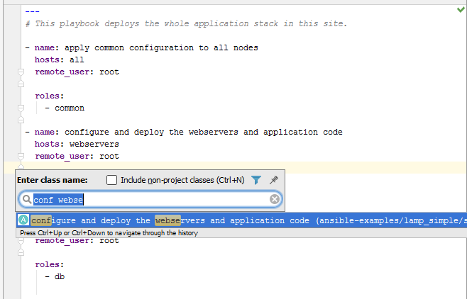
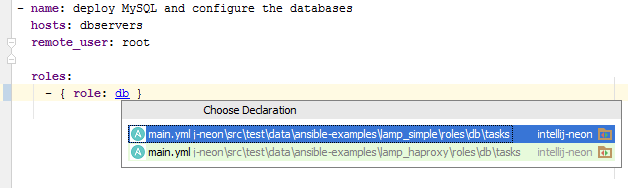
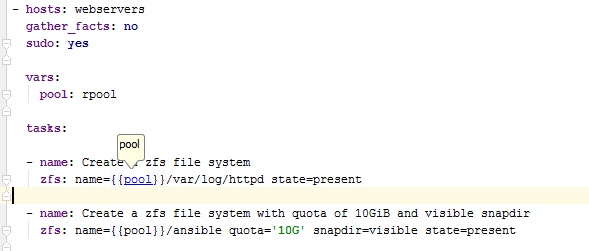

# YAML/Ansible in IntelliJ IDEA 

**Current status: stable, basic functions**

 
 
 
 

## Features
* Goto role (Ctrl-N)
* Goto task (Ctrl-N)
* Goto var/property (Ctrl-Alt-Shift-N)
* Role/Jinja var reference on Ctrl-Click
* Module doc lookup
* lexer, parser (internal)
* syntax highlighting 
* comment/uncomment
* bracket / parenthesis matching
* role completion

## Install
**Current version** 
[Download](.idea/intellij-ansible.zip) and install via
 
1. Go to File → Settings in PhpStorm
2. Select *Plugins* on the left
3. Install from disk file...

**Stable version** (not-crashing alpha) is available in official plugin repository:

1. Go to File → Settings in PhpStorm
2. Select *Plugins* on the left
3. Click *Browse Repositories* button on the bottom
4. Find *YAML/Ansible* and install it

If you prefer your own build from *master*, open this project in *IntelliJ IDEA* as a *Plugin project*, go to *Build* -> *Prepare for deployment* and install it in your Idea.

## Development
This plugin is in its early development phase, it's not complete at all and it will contain many bugs!
 Be careful if you decide to use it.

Please tell me what **features** you'd like in *Issues tab*.

If you want to contribute, please read [development.md](development.md)
